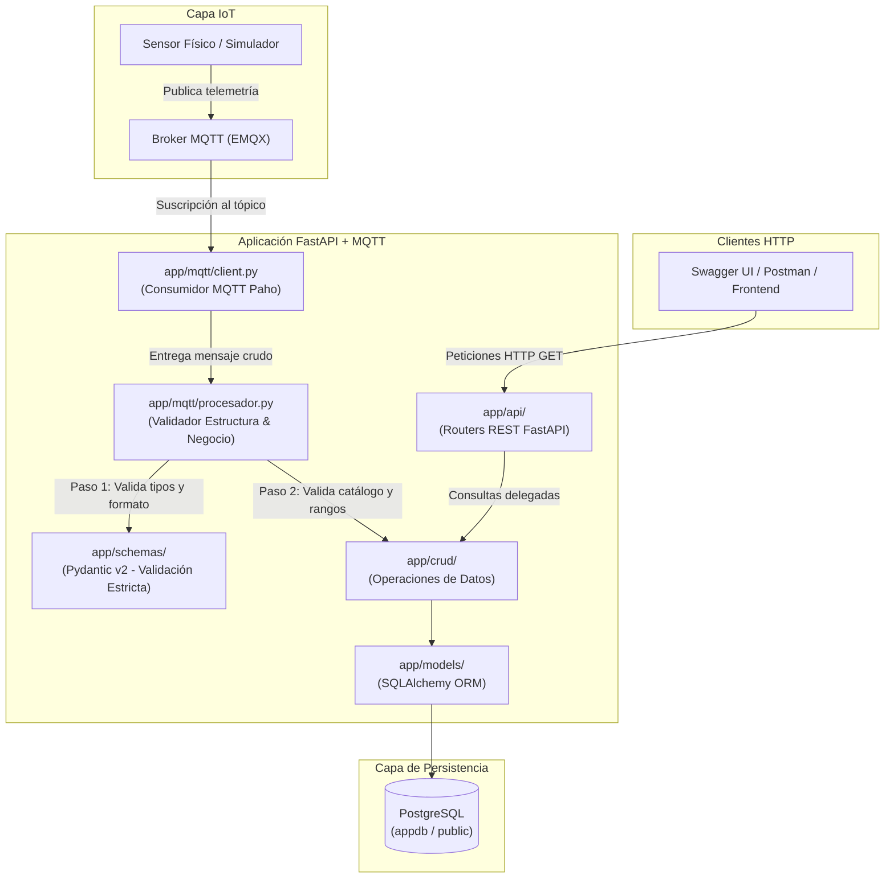
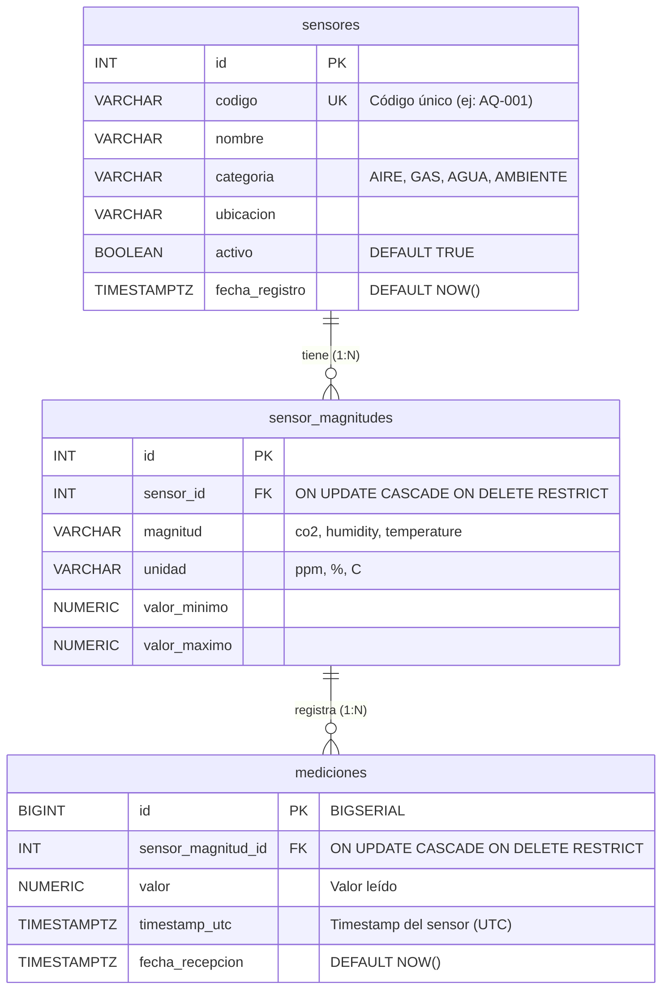

# Taller 2 — API para Adquisición, Validación y Consulta de Datos IoT con FastAPI, MQTT y PostgreSQL

Aplicación backend completa desarrollada con **FastAPI**, **SQLAlchemy ORM**, **Pydantic v2** y **Paho-MQTT** para la ingesta continua, validación estricta en dos fases, almacenamiento atómico en **PostgreSQL** y consulta histórica de mediciones de sensores IoT.

---

## 1. Información General

| Campo | Detalle |
|---|---|
| **Proyecto** | Taller 2 — Adquisición, validación y consulta de datos IoT |
| **Asignatura** | Aplicaciones y Servicios Web |
| **Programa** | Tecnología en Desarrollo de Software |
| **Institución / Laboratorio** | Institución Universitaria ITM |
| **Fecha** | 07 al 10 de Octubre 2026 |
| **Integrantes** | • Kevin Stiven Montoya Suarez (`KevinStiven04`)<br>• José Manuel Gutiérrez Sosa (`Jos3GS`) |
| **Sensor Asignado** | `AQ-001` (Calidad de aire interior) |
| **Tópico MQTT Asignado** | `iot/sensors/AQ-001/data` |
| **Broker MQTT** | `emqx.coriotlab.co:1883` |
| **Repositorio GitHub** | [https://github.com/KevinStiven04/TALLER_2_SERVICIOS_WEB](https://github.com/KevinStiven04/TALLER_2_SERVICIOS_WEB) |

---

## 2. Descripción del Sistema

### Problema Resuelto
El sistema soluciona la problemática de ingesta masiva y no confiable de telemetría IoT mediante:
1. Recepción asíncrona de mensajes JSON publicados por sensores en un broker MQTT.
2. Filtrado y rechazo de payloads inválidos (formato corrupto, unidades erróneas, magnitudes inexistentes, datos fuera de rango operativo o sensores inactivos/inexistentes).
3. Persistencia atómica de mediciones válidas bajo el modelo relacional suministrado en PostgreSQL.
4. Exposición de endpoints REST mediante FastAPI que permiten la consulta filtrada, histórica y en tiempo real, normalizando los timestamps a la zona horaria local de Colombia (`America/Bogota`) en un formato legible.

### Arquitectura Implementada



### Magnitudes y Unidades Recibidas (Sensor `AQ-001`)

El sensor asignado (`AQ-001`) monitorea calidad de aire interior y mide tres magnitudes físicas:

| Magnitud | Unidad | Valor Mínimo | Valor Máximo | Descripción |
|---|:---:|:---:|:---:|---|
| `temperature` | `C` | 10.0000 | 45.0000 | Temperatura ambiental en grados Celsius |
| `humidity` | `%` | 0.0000 | 100.0000 | Humedad relativa porcentual |
| `co2` | `ppm` | 300.0000 | 5000.0000 | Concentración de dióxido de carbono |

### Payload Real del Sensor

Mensaje JSON capturado en vivo desde el broker `emqx.coriotlab.co` en el tópico `iot/sensors/AQ-001/data`:

```json
{
  "sensor_id": "AQ-001",
  "timestamp": "2026-10-09T00:50:22Z",
  "measurements": {
    "temperature": {
      "value": 29.56,
      "unit": "C"
    },
    "humidity": {
      "value": 62.59,
      "unit": "%"
    },
    "co2": {
      "value": 1157.07,
      "unit": "ppm"
    }
  }
}
```

---

## 3. Configuración del Entorno

### Requisitos Previos
* Python 3.10 o superior (desarrollado y probado con Python 3.14).
* Acceso a internet para conexión al broker MQTT y base de datos PostgreSQL.
* Git.

### Instalación Paso a Paso

1. **Clonar el repositorio y situarse en la rama del taller:**
   ```bash
   git clone https://github.com/KevinStiven04/TALLER_2_SERVICIOS_WEB.git
   cd TALLER_2_SERVICIOS_WEB
   git checkout taller-2
   ```

2. **Crear y activar el entorno virtual:**
   * En Windows (PowerShell):
     ```powershell
     python -m venv .venv
     .venv\Scripts\Activate.ps1
     ```
   * En Linux / macOS:
     ```bash
     python3 -m venv .venv
     source .venv/bin/activate
     ```

3. **Instalar dependencias del proyecto:**
   ```bash
   pip install --upgrade pip
   pip install -r requirements.txt
   ```

4. **Configuración de Variables de Entorno:**
   Copiar la plantilla de ejemplo [`.env.example`](file:///C:/Users/guti-/PycharmProjects/TALLER_2_SERVICIOS_WEB/.env.example) a un archivo local `.env`:
   ```bash
   cp .env.example .env
   ```

   Completar los valores sin comillas (el archivo `.env` está estrictamente ignorado en `.gitignore`):
   ```env
   # --- PostgreSQL ---
   DB_HOST=190.248.28.132
   DB_PORT=5432
   DB_NAME=appdb
   DB_USER=tu_usuario
   DB_PASSWORD=tu_password

   # --- MQTT Broker ---
   MQTT_BROKER=emqx.coriotlab.co
   MQTT_PORT=1883
   MQTT_TOPIC=iot/sensors/AQ-001/data
   MQTT_USERNAME=
   MQTT_PASSWORD=
   MQTT_KEEPALIVE=60

   # true: inicia el consumidor MQTT junto con la API. false: solo la API.
   MQTT_ENABLED=true

   # URL base para scripts de pruebas y evidencias
   API_URL=http://127.0.0.1:8000
   ```

5. **Ejecutar la API:**
   ```bash
   uvicorn app.main:app --reload --host 127.0.0.1 --port 8000
   ```
   La documentación interactiva estará disponible en:
   * **Swagger UI:** [http://127.0.0.1:8000/docs](http://127.0.0.1:8000/docs)
   * **ReDoc:** [http://127.0.0.1:8000/redoc](http://127.0.0.1:8000/redoc)

---

## 4. Base de Datos

### Conexión
La conexión se gestiona en [`app/database/connection.py`](file:///C:/Users/guti-/PycharmProjects/TALLER_2_SERVICIOS_WEB/app/database/connection.py) utilizando SQLAlchemy ORM con el driver `psycopg2-binary`. Se implementa una sesión transaccional mediante generador `get_db()` inyectado como dependencia (`Depends`) en FastAPI.

### Tablas y Relaciones
El diseño cumple con la especificación técnica de [`data-model.md`](file:///C:/Users/guti-/PycharmProjects/TALLER_2_SERVICIOS_WEB/data-model.md):



* **Integridad Referencial:** Ambas claves foráneas tienen restricción `ON UPDATE CASCADE ON DELETE RESTRICT`, garantizando que no se puedan eliminar sensores o magnitudes que cuenten con historial de telemetría.
* **Índices de Rendimiento:**
  * `idx_mediciones_sensor_magnitud` (B-tree) en `sensor_magnitud_id`.
  * `idx_mediciones_timestamp_utc` (B-tree) en `timestamp_utc`.
  * `idx_mediciones_magnitud_timestamp` (B-tree compuesto) en `(sensor_magnitud_id, timestamp_utc)`.

---

## 5. Organización del Código y Separación de Responsabilidades

La estructura de la solución respeta rigurosamente el principio de responsabilidad única y la arquitectura por capas:

```text
TALLER_2_SERVICIOS_WEB/
├── app/
│   ├── main.py                     # Punto de entrada FastAPI, ciclo de vida lifespan y routers
│   ├── api/                        # Capa de presentación REST (solo HTTP, status codes y validación)
│   │   ├── sensor.py               # Endpoints /sensores
│   │   ├── sensor_magnitud.py      # Endpoints /sensor-magnitudes
│   │   └── medicion.py             # Endpoints /mediciones y filtros históricos
│   ├── crud/                       # Capa de acceso a datos (ORM exclusivo, consultas y transacciones)
│   │   ├── sensor.py               # Consultas por ID y código
│   │   ├── sensor_magnitud.py      # Consultas de magnitudes por sensor y catálogo
│   │   └── medicion.py             # Inserción atómica en lote y filtros combinados
│   ├── database/                   # Configuración del motor y sesión de PostgreSQL
│   │   └── connection.py           # Engine, declarative_base y get_db()
│   ├── models/                     # Entidades SQLAlchemy ORM
│   │   ├── __init__.py             # Registro centralizado de mappers
│   │   ├── sensor.py               # Entidad Sensor
│   │   ├── sensor_magnitud.py      # Entidad SensorMagnitud
│   │   └── medicion.py             # Entidad Medicion
│   ├── mqtt/                       # Consumo asíncrono y lógica de procesamiento IoT
│   │   ├── client.py               # Cliente Paho MQTT, conexión y reconexión
│   │   └── procesador.py           # Reglas de negocio "todo o nada", Pydantic y guardado atómico
│   └── schemas/                    # Contratos Pydantic v2
│       ├── fechas.py               # Serializador de hora local Colombia
│       ├── sensor.py               # Esquemas de entrada y salida para sensores
│       ├── sensor_magnitud.py      # Esquemas para configuración de magnitudes
│       └── medicion.py             # Esquemas estrictos de payload MQTT y respuesta API
├── evidencias/                     # Carpeta de evidencias obligatorias
│   ├── evidencias.md               # Resultados de las 18 pruebas automatizadas
│   └── mqtt_log.txt                # Registro real del consumidor MQTT
├── scripts/                        # Scripts de soporte para pruebas y verificación
│   ├── generar_evidencias.py       # Ejecución y generación de evidencias.md
│   ├── probar_validaciones.py      # Pruebas de rechazo de payloads inválidos
│   └── verificar_db.py             # Inspección rápida del estado de PostgreSQL
├── .env.example                    # Plantilla de variables de entorno sin credenciales
├── .gitignore                      # Reglas de exclusión de git (.env, venv, pycache, etc.)
├── data-model.md                   # Especificación técnica del modelo de datos
├── mqtt_example.py                 # Script de ejemplo de consumo MQTT
├── README.md                       # Informe técnico del proyecto
└── requirements.txt                # Dependencias fijadas del proyecto
```

---

## 6. Endpoints Implementados

| Método | Ruta | Parámetros | Códigos HTTP | Descripción |
|---|---|---|:---:|---|
| `GET` | `/sensores` | `skip: int = 0`, `limit: int = 100` | `200` | Lista todos los sensores del catálogo con paginación. |
| `GET` | `/sensores/{id}` | `id: int` (Path) | `200`, `404`, `422` | Retorna la información de un sensor por su ID primario. |
| `GET` | `/sensores/por-codigo/{codigo}` | `codigo: str` (Path) | `200`, `404` | Retorna un sensor a partir de su código único (ej: `AQ-001`). |
| `GET` | `/sensores/{id}/magnitudes` | `id: int` (Path) | `200`, `404`, `422` | Retorna la lista de magnitudes configuradas para un sensor. |
| `GET` | `/sensor-magnitudes/{id}` | `id: int` (Path) | `200`, `404`, `422` | Retorna el detalle de una configuración de magnitud por su ID. |
| `GET` | `/mediciones/{id}` | `id: int` (Path) | `200`, `404`, `422` | Retorna una medición individual por su ID con fecha convertida a Colombia. |
| `GET` | `/sensores/{id}/mediciones` | `magnitud: str` (opcional)<br>`desde: datetime` (opcional)<br>`hasta: datetime` (opcional)<br>`limit: int = 100` | `200`, `400`, `404`, `422` | Consulta histórica combinada. Valida `desde <= hasta` (`400`) y `limit >= 1` (`422`). |
| `GET` | `/sensores/{id}/ultima-medicion` | `magnitud: str` (opcional) | `200`, `404`, `422` | Retorna la medición más reciente del sensor en orden cronológico inverso. |

### Conversión de Fechas a Hora Local de Colombia
Siguiendo el requerimiento de la práctica, las fechas se almacenan en PostgreSQL en **UTC puro** y se convierten en todas las respuestas GET a la hora legal de la República de Colombia (`America/Bogota`, UTC-5) con formato legible `YYYY-MM-DD HH:MM:SS`:

```json
{
  "id": 1155,
  "sensor_magnitud_id": 1,
  "magnitud": "temperature",
  "unidad": "C",
  "valor": "22.2700",
  "timestamp_colombia": "2026-10-08 19:50:42",
  "fecha_recepcion": "2026-10-08 19:50:43"
}
```

---

## 7. Evidencias de Funcionamiento

Todas las pruebas obligatorias de la **Actividad 6** fueron ejecutadas y se encuentran documentadas en [`evidencias/evidencias.md`](file:///C:/Users/guti-/PycharmProjects/TALLER_2_SERVICIOS_WEB/evidencias/evidencias.md) y [`evidencias/mqtt_log.txt`](file:///C:/Users/guti-/PycharmProjects/TALLER_2_SERVICIOS_WEB/evidencias/mqtt_log.txt).

### Resumen de Pruebas Obligatorias (18/18 Superadas)

| # | Prueba | Entrada | Código HTTP | Resultado | Archivo & Función |
|:---:|---|---|:---:|:---:|---|
| **1** | **Recepción MQTT** | Tópico `iot/sensors/AQ-001/data` | N/A (MQTT) | ✅ OK | [`app/mqtt/client.py`](file:///C:/Users/guti-/PycharmProjects/TALLER_2_SERVICIOS_WEB/app/mqtt/client.py) `on_message` |
| **2** | **Medición válida** | Payload real con magnitudes válidas | N/A (MQTT) | ✅ OK (Guardado) | [`app/crud/medicion.py`](file:///C:/Users/guti-/PycharmProjects/TALLER_2_SERVICIOS_WEB/app/crud/medicion.py) `create_mediciones_batch` |
| **3** | **Sensor inexistente** | Payload con `sensor_id="NO-EXISTE-999"` | N/A (MQTT) | ✅ Rechazado | [`app/mqtt/procesador.py`](file:///C:/Users/guti-/PycharmProjects/TALLER_2_SERVICIOS_WEB/app/mqtt/procesador.py) `validar_negocio` |
| **4** | **Unidad incorrecta** | `unit="XYZ"` en vez de `ppm` | N/A (MQTT) | ✅ Rechazado | [`app/mqtt/procesador.py`](file:///C:/Users/guti-/PycharmProjects/TALLER_2_SERVICIOS_WEB/app/mqtt/procesador.py) `validar_negocio` |
| **5** | **Tipo de dato incorrecto** | `value="22.5"` (string en lugar de float) | N/A (MQTT) | ✅ Rechazado | [`app/schemas/medicion.py`](file:///C:/Users/guti-/PycharmProjects/TALLER_2_SERVICIOS_WEB/app/schemas/medicion.py) `MeasurementValue` (`strict=True`) |
| **6** | **Magnitud incorrecta** | Magnitud no asignada `magnitud_falsa` | N/A (MQTT) | ✅ Rechazado | [`app/mqtt/procesador.py`](file:///C:/Users/guti-/PycharmProjects/TALLER_2_SERVICIOS_WEB/app/mqtt/procesador.py) `validar_negocio` |
| **7** | **Timestamp inválido** | Cadena de fecha no estándar o inválida | N/A (MQTT) | ✅ Rechazado | [`app/schemas/medicion.py`](file:///C:/Users/guti-/PycharmProjects/TALLER_2_SERVICIOS_WEB/app/schemas/medicion.py) `MQTTPayload` (`AwareDatetime`) |
| **8** | **Consulta por ID existente** | `GET /sensores/1`, `GET /mediciones/1155` | `200 OK` | ✅ Retornado | [`app/api/sensor.py`](file:///C:/Users/guti-/PycharmProjects/TALLER_2_SERVICIOS_WEB/app/api/sensor.py), [`app/api/medicion.py`](file:///C:/Users/guti-/PycharmProjects/TALLER_2_SERVICIOS_WEB/app/api/medicion.py) |
| **9** | **Consulta por ID inexistente** | `GET /sensores/999999` | `404 Not Found` | ✅ 404 claro | [`app/api/sensor.py`](file:///C:/Users/guti-/PycharmProjects/TALLER_2_SERVICIOS_WEB/app/api/sensor.py) `get_sensor_por_id` |
| **10** | **Consulta histórica** | `GET /sensores/1/mediciones` | `200 OK` | ✅ Retornado | [`app/crud/medicion.py`](file:///C:/Users/guti-/PycharmProjects/TALLER_2_SERVICIOS_WEB/app/crud/medicion.py) `get_mediciones_by_sensor` |
| **11** | **Consulta por rango de fechas** | `?desde=2026-10-08 19:00:00&hasta=...` | `200 OK` | ✅ Filtrado | [`app/api/medicion.py`](file:///C:/Users/guti-/PycharmProjects/TALLER_2_SERVICIOS_WEB/app/api/medicion.py) `normalizar_a_utc` |
| **12** | **Rango `desde > hasta`** | Parámetro `desde` posterior a `hasta` | `400 Bad Request` | ✅ 400 controlado | [`app/api/medicion.py`](file:///C:/Users/guti-/PycharmProjects/TALLER_2_SERVICIOS_WEB/app/api/medicion.py) `get_mediciones_por_sensor` |
| **13** | **Validación HTTP incorrecta** | `GET /sensores/abc`, `limit=0` | `422 Unprocessable` | ✅ 422 automático | FastAPI type enforcement |
| **14** | **Última medición** | `GET /sensores/1/ultima-medicion` | `200 OK` | ✅ Más reciente | [`app/crud/medicion.py`](file:///C:/Users/guti-/PycharmProjects/TALLER_2_SERVICIOS_WEB/app/crud/medicion.py) `get_ultima_medicion` |
| **15** | **Últimas N mediciones** | `GET /sensores/1/mediciones?limit=5` | `200 OK` | ✅ 5 registros | [`app/api/medicion.py`](file:///C:/Users/guti-/PycharmProjects/TALLER_2_SERVICIOS_WEB/app/api/medicion.py) `limit` |
| **16** | **Filtro por magnitud** | `?magnitud=co2&limit=5` | `200 OK` | ✅ Filtrado | [`app/crud/medicion.py`](file:///C:/Users/guti-/PycharmProjects/TALLER_2_SERVICIOS_WEB/app/crud/medicion.py) `get_mediciones_by_sensor` |
| **17** | **Claves foráneas** | JOIN ORM entre mediciones, magnitudes y sensores | `200 OK` | ✅ Relación íntegra | [`app/models/sensor_magnitud.py`](file:///C:/Users/guti-/PycharmProjects/TALLER_2_SERVICIOS_WEB/app/models/sensor_magnitud.py) y [`app/models/medicion.py`](file:///C:/Users/guti-/PycharmProjects/TALLER_2_SERVICIOS_WEB/app/models/medicion.py) |
| **18** | **Separación de responsabilidades** | Inspección estructural de `app/` | N/A | ✅ Modular | Toda la estructura `app/` |

---

## 8. Control de Versiones y Trabajo Colaborativo

* **Rama oficial de entrega:** `taller-2`
* **Enlace al repositorio remoto:** [https://github.com/KevinStiven04/TALLER_2_SERVICIOS_WEB](https://github.com/KevinStiven04/TALLER_2_SERVICIOS_WEB)

### Historial de Participación y Aportes del Equipo

El desarrollo del proyecto se ejecutó de forma equilibrada mediante ramas de características integradas progresivamente:

| Integrante | Usuario GitHub | Aportes Principales |
|---|---|---|
| **Kevin Stiven Montoya Suarez** | `KevinStiven04` | • Configuración inicial del repositorio y conexión a PostgreSQL.<br>• Definición de esquemas de validación Pydantic.<br>• Implementación de rutas y endpoints de la API en FastAPI.<br>• Integración de routers en `main.py` y ciclo de vida de la aplicación. |
| **José Manuel Gutiérrez Sosa** | `Jos3GS` | • Configuración del entorno virtual y dependencias iniciales.<br>• Modelado relacional SQLAlchemy ORM para sensores y mediciones.<br>• Implementación de la capa de persistencia y lógica CRUD.<br>• Cliente MQTT, procesador de negocio "todo o nada", transaccionalidad atómica y recolección de evidencias. |

---

## 9. Conclusiones

1. **Robustez ante fallas con validación en dos pasos:** Separar la validación sintáctica (Pydantic con `strict=True` y `AwareDatetime`) de la semántica de negocio (ORM contra el catálogo de la base de datos) garantizó que ningún payload mal formado o con lecturas fuera de rango corrompiera los datos históricos.
2. **Atomicidad e idempotencia en IoT:** En entornos de telemetría los brokers pueden enviar mensajes duplicados o con múltiples magnitudes en un solo payload. Implementar transaccionalidad atómica (o se guardan todas las magnitudes de un timestamp o ninguna) y filtros de duplicados previene inconsistencias graves en los registros.
3. **Manejo coherente de zonas horarias:** Almacenar siempre en UTC en PostgreSQL y delegar la conversión a hora legal de Colombia (`America/Bogota`) en la serialización de salida mediante un serializador personalizado de Pydantic simplifica los filtros temporales y cumple el estándar internacional de telemetría.
4. **Separación de responsabilidades:** Evitar que los controladores de FastAPI ejecuten consultas SQL directas o conozcan la lógica de persistencia facilitó las pruebas unitarias y mantuvo el código limpio, mantenible y escalable.
